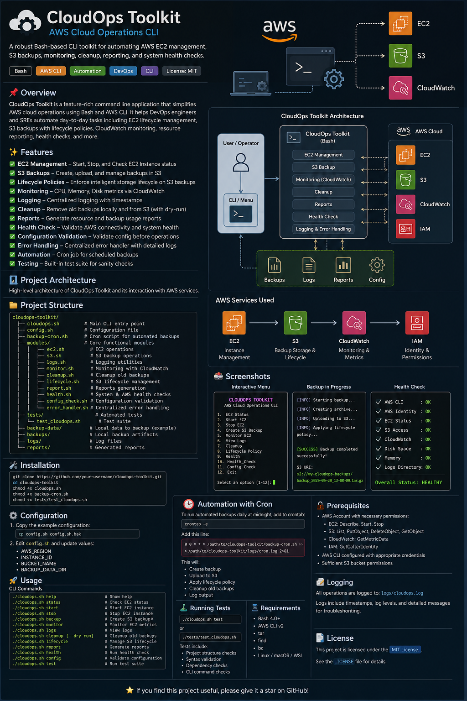
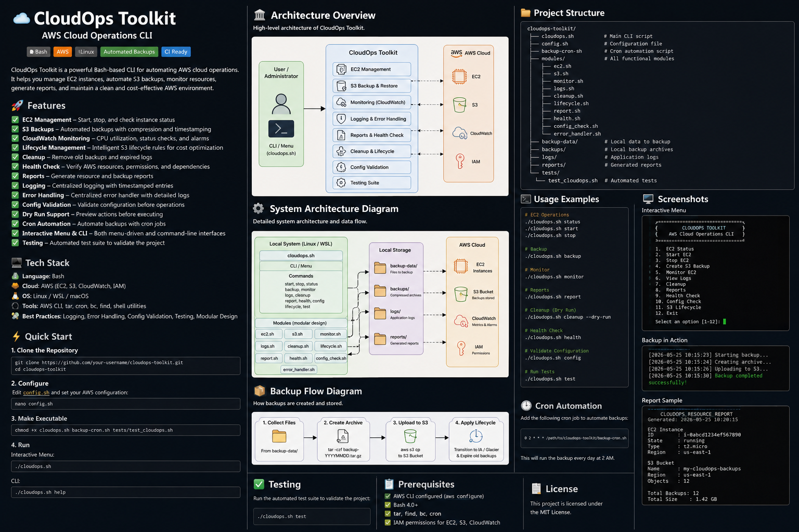

# ☁️ CloudOps Toolkit

> **AWS Cloud Operations CLI built with Bash scripting and the AWS CLI**

CloudOps Toolkit is a modular Bash-based command-line application
designed to automate common AWS CloudOps and DevOps tasks from a
Linux/WSL terminal.

It provides a single interface for **EC2 management, S3 backups,
CloudWatch monitoring, lifecycle management, cleanup, health checks,
reporting, configuration validation, logging, error handling, dry-run
operations, scheduled backups, and automated testing**.

------------------------------------------------------------------------

## 🚀 Why This Project?

Cloud engineers and DevOps engineers frequently perform repetitive
operational tasks such as:

-   Checking EC2 instance status
-   Starting and stopping instances
-   Creating backups
-   Uploading archives to S3
-   Monitoring cloud resources
-   Cleaning old backups
-   Checking AWS connectivity and permissions
-   Generating operational reports
-   Running scheduled automation

Instead of executing individual AWS CLI commands manually, CloudOps
Toolkit provides a reusable Bash CLI that groups these operations into
one maintainable project.

------------------------------------------------------------------------

## ✨ Features

  -----------------------------------------------------------------------
  Feature                             Description
  ----------------------------------- -----------------------------------
  🖥️ **EC2 Management**               Check, start, and stop EC2
                                      instances

  ☁️ **S3 Backups**                   Create compressed backups and
                                      upload them to S3

  📊 **CloudWatch Monitoring**        Monitor EC2 metrics and cloud
                                      resources

  ♻️ **S3 Lifecycle**                 Configure lifecycle rules for
                                      backup objects

  🧹 **Cleanup**                      Remove old local/S3 backups
                                      according to retention rules

  🩺 **Health Check**                 Validate AWS CLI, credentials, EC2,
                                      S3, CloudWatch, and local
                                      directories

  📋 **Reports**                      Generate AWS resource and backup
                                      reports

  📝 **Logging**                      Centralized timestamped operational
                                      logs

  🚨 **Error Handling**               Centralized Bash error handling
                                      using `trap`

  ⚙️ **Config Validation**            Validate project configuration
                                      before operations

  🛡️ **Dry Run**                      Preview destructive cleanup
                                      operations without making changes

  ⏰ **Cron Automation**              Schedule recurring backup
                                      operations

  🧪 **Automated Testing**            Validate project structure, syntax,
                                      dependencies, and CLI commands

  🖥️ **Interactive CLI**              Menu-driven interface as well as
                                      direct commands

  🧩 **Modular Design**               AWS operations separated into
                                      reusable Bash modules
  -----------------------------------------------------------------------

------------------------------------------------------------------------

## 🏗️ Architecture

### High-Level Architecture

``` text
                         ┌───────────────────────────┐
                         │       User / Operator     │
                         └─────────────┬─────────────┘
                                       │
                                       ▼
                         ┌───────────────────────────┐
                         │       cloudops.sh         │
                         │   CLI + Interactive Menu  │
                         └─────────────┬─────────────┘
                                       │
             ┌─────────────────────────┼─────────────────────────┐
             │                         │                         │
             ▼                         ▼                         ▼
      ┌─────────────┐          ┌─────────────┐          ┌─────────────┐
      │ EC2 Module  │          │ S3 Module   │          │ Monitoring  │
      │   ec2.sh   │          │   s3.sh     │          │ monitor.sh  │
      └──────┬──────┘          └──────┬──────┘          └──────┬──────┘
             │                        │                        │
             ▼                        ▼                        ▼
          ┌─────┐                  ┌─────┐               ┌───────────┐
          │ EC2 │                  │ S3  │               │CloudWatch │
          └─────┘                  └─────┘               └───────────┘

             ┌────────────────────────────────────────────────────┐
             │ Supporting Modules                                │
             │ logs.sh | cleanup.sh | lifecycle.sh | report.sh  │
             │ health.sh | config_check.sh | error_handler.sh    │
             └────────────────────────────────────────────────────┘
```

### Backup Flow

``` text
┌──────────────┐
│ backup-data/ │
│ Source Files │
└──────┬───────┘
       │
       ▼
┌──────────────────┐
│ Create TAR/GZIP  │
│ Compressed Backup│
└────────┬─────────┘
         │
         ▼
┌──────────────────┐
│    backups/      │
│ Local Archive    │
└────────┬─────────┘
         │
         ▼
┌──────────────────┐
│   AWS S3 Bucket  │
│ Remote Backup    │
└────────┬─────────┘
         │
         ▼
┌──────────────────┐
│ Lifecycle Policy │
│ Storage / Expiry │
└──────────────────┘
```

### Operational Flow

``` text
                    ┌──────────────┐
                    │ CloudOps CLI │
                    └──────┬───────┘
                           │
       ┌───────────────────┼───────────────────┐
       │                   │                   │
       ▼                   ▼                   ▼
   EC2 Ops             Backup Ops        Monitoring
       │                   │                   │
       ▼                   ▼                   ▼
     EC2                  S3               CloudWatch
       │                   │                   │
       └───────────────────┼───────────────────┘
                           ▼
                 ┌──────────────────┐
                 │ Logs + Reports   │
                 └──────────────────┘
```

------------------------------------------------------------------------

## 📁 Project Structure

``` text
cloudops-toolkit/
│
├── cloudops.sh                 # Main CLI entry point
├── config.sh                   # Project configuration
├── backup-cron.sh              # Scheduled backup script
│
├── modules/
│   ├── ec2.sh                  # EC2 operations
│   ├── s3.sh                   # S3 backup operations
│   ├── logs.sh                 # Centralized logging
│   ├── monitor.sh              # CloudWatch monitoring
│   ├── cleanup.sh              # Backup cleanup + dry-run
│   ├── lifecycle.sh            # S3 lifecycle management
│   ├── report.sh               # Resource/backup reports
│   ├── health.sh               # CloudOps health check
│   ├── config_check.sh         # Configuration validation
│   └── error_handler.sh        # Centralized error handling
│
├── tests/
│   └── test_cloudops.sh        # Automated test suite
│
├── backup-data/                # Files selected for backup
├── backups/                    # Generated local backup archives
├── logs/                       # Application logs
├── reports/                    # Generated reports
│
├── docs/
│   ├── architecture.png        # Architecture diagram
│   └── backup-flow.png         # Backup flow diagram
│
├── .gitignore
├── LICENSE
└── README.md
```

> Generated backup archives, logs, and reports should normally be
> excluded from Git using `.gitignore`.

------------------------------------------------------------------------

## 🛠️ Technology Stack

### Core

-   **Bash**
-   **Linux / WSL**
-   **AWS CLI**

### AWS Services

-   **Amazon EC2**
-   **Amazon S3**
-   **Amazon CloudWatch**
-   **AWS IAM / STS**

### Linux / DevOps Tools

-   `tar`
-   `find`
-   `bc`
-   `cron`
-   `bash -n`
-   Shell scripting utilities

### Engineering Practices

-   Modular scripting
-   Configuration management
-   Defensive Bash scripting
-   Error handling
-   Logging
-   Dry-run safety
-   Automated testing
-   Scheduled automation

------------------------------------------------------------------------

## 📋 Prerequisites

Before running CloudOps Toolkit, make sure you have:

-   Linux, Ubuntu, WSL, or macOS
-   Bash 4+
-   AWS CLI v2
-   `tar`
-   `find`
-   `bc`
-   An AWS account
-   AWS CLI configured with credentials
-   An S3 bucket for backups
-   Appropriate IAM permissions

Check your tools:

``` bash
bash --version
aws --version
tar --version
find --version
bc --version
```

------------------------------------------------------------------------

## ☁️ AWS Configuration

Configure the AWS CLI:

``` bash
aws configure
```

Verify your identity:

``` bash
aws sts get-caller-identity
```

Verify your region:

``` bash
aws configure get region
```

The IAM identity used by the project should have only the permissions
required for the operations you intend to perform.

Typical permissions may include:

``` text
EC2
├── DescribeInstances
├── StartInstances
└── StopInstances

S3
├── ListBucket
├── GetObject
├── PutObject
├── DeleteObject
└── GetObject

CloudWatch
└── ListMetrics / metric read operations

STS
└── GetCallerIdentity
```

> For production use, follow the principle of least privilege and avoid
> using an unrestricted administrator identity.

------------------------------------------------------------------------

## ⚙️ Configuration

Open:

``` bash
nano config.sh
```

or:

``` bash
code config.sh
```

Configure values such as:

``` bash
AWS_REGION="your-region"

INSTANCE_ID="your-ec2-instance-id"

BUCKET_NAME="your-s3-bucket"

BACKUP_SOURCE="backup-data"

BACKUP_DIR="backups"

LOG_FILE="logs/cloudops.log"

BACKUP_RETENTION_DAYS=7

S3_LIFECYCLE_DAYS=7
```

Use your actual values.

Do **not** commit AWS access keys, secret keys, passwords, or other
credentials to GitHub.

------------------------------------------------------------------------

## 🚀 Installation

Clone the repository:

``` bash
git clone https://github.com/<your-username>/cloudops-toolkit.git
```

Enter the project:

``` bash
cd cloudops-toolkit
```

Make the scripts executable:

``` bash
chmod +x cloudops.sh
chmod +x backup-cron.sh
chmod +x tests/test_cloudops.sh
```

Validate the Bash syntax:

``` bash
bash -n cloudops.sh
```

Validate configuration:

``` bash
./cloudops.sh config
```

Run the health check:

``` bash
./cloudops.sh health
```

------------------------------------------------------------------------

## 🖥️ Usage

### Interactive Mode

Run:

``` bash
./cloudops.sh
```

The interactive menu provides operations such as:

``` text
1. EC2 Status
2. Start EC2
3. Stop EC2
4. Create S3 Backup
5. Monitor EC2
6. View Logs
7. Cleanup
8. AWS Resource Report
9. Health Check
10. Configuration Check
11. Exit
```

------------------------------------------------------------------------

## ⌨️ CLI Commands

### Show Help

``` bash
./cloudops.sh help
```

### EC2 Status

``` bash
./cloudops.sh status
```

### Start EC2

``` bash
./cloudops.sh start
```

### Stop EC2

``` bash
./cloudops.sh stop
```

### Create Backup

``` bash
./cloudops.sh backup
```

### Monitor EC2

``` bash
./cloudops.sh monitor
```

### View Logs

``` bash
./cloudops.sh logs
```

### Cleanup Old Backups

``` bash
./cloudops.sh cleanup
```

### Preview Cleanup

Use dry-run before destructive operations:

``` bash
./cloudops.sh cleanup --dry-run
```

Dry-run mode displays what would be removed without deleting it.

### S3 Lifecycle

``` bash
./cloudops.sh lifecycle
```

### Generate Report

``` bash
./cloudops.sh report
```

### Health Check

``` bash
./cloudops.sh health
```

### Validate Configuration

``` bash
./cloudops.sh config
```

### Run Tests

``` bash
./cloudops.sh test
```

------------------------------------------------------------------------

## 💾 Backup Process

The backup workflow is:

``` text
1. Read files from backup-data/
              ↓
2. Create compressed archive
              ↓
3. Store archive in backups/
              ↓
4. Upload archive to S3
              ↓
5. Apply S3 lifecycle policy
              ↓
6. Log the operation
```

Example:

``` bash
./cloudops.sh backup
```

A backup might look like:

``` text
backups/
└── backup_2026-08-25_20-30-00.tar.gz
```

The same archive can then be uploaded to:

``` text
s3://<bucket-name>/backups/
```

------------------------------------------------------------------------

## ⏰ Automated Backups with Cron

CloudOps Toolkit can be scheduled using Linux cron.

Edit your crontab:

``` bash
crontab -e
```

Example: run a backup every day at 2:00 AM:

``` cron
0 2 * * * /path/to/cloudops-toolkit/backup-cron.sh >> /path/to/cloudops-toolkit/logs/cron.log 2>&1
```

Verify scheduled jobs:

``` bash
crontab -l
```

The automated workflow becomes:

``` text
             Cron
              │
              ▼
       backup-cron.sh
              │
              ▼
        cloudops.sh
              │
              ▼
       Create Backup
              │
              ▼
            S3
              │
              ▼
       Lifecycle Policy
              │
              ▼
            Logs
```

------------------------------------------------------------------------

## 📊 Monitoring

The monitoring module uses AWS CloudWatch to inspect EC2-related
metrics.

Typical operational metrics can include:

-   CPU utilization
-   Instance state
-   CloudWatch metric availability
-   Resource status

Run:

``` bash
./cloudops.sh monitor
```

This project is intended as a learning-focused CloudOps toolkit rather
than a replacement for enterprise observability platforms.

------------------------------------------------------------------------

## 🩺 Health Check

Run:

``` bash
./cloudops.sh health
```

The health check validates areas such as:

``` text
AWS CLI              ✓
AWS Credentials      ✓
AWS Account          ✓
S3 Bucket            ✓
EC2 Access           ✓
CloudWatch Access    ✓
Backup Directory     ✓
Log Directory        ✓
```

This provides a simple pre-flight check before running operational
commands.

------------------------------------------------------------------------

## ⚙️ Configuration Validation

Run:

``` bash
./cloudops.sh config
```

This validates configuration values such as:

``` text
AWS Region
S3 Bucket
Backup Source
Backup Directory
Log Directory
Retention Days
S3 Lifecycle Days
```

This helps identify configuration problems before an actual backup or
cleanup operation begins.

------------------------------------------------------------------------

## 🛡️ Dry-Run Safety

Destructive automation should be previewable before execution.

Use:

``` bash
./cloudops.sh cleanup --dry-run
```

Example:

``` text
========================================
          CLEANUP - DRY RUN
========================================

Files identified for cleanup:

  backups/backup_old.tar.gz
  backups/backup_older.tar.gz

DRY RUN: No files were deleted.
```

Normal cleanup requires explicit confirmation before deletion.

------------------------------------------------------------------------

## 📝 Logging

CloudOps Toolkit maintains centralized logs under:

``` text
logs/cloudops.log
```

Example:

``` text
[2026-08-25 20:15:23] Backup started
[2026-08-25 20:15:25] Creating archive
[2026-08-25 20:15:29] Uploading backup to S3
[2026-08-25 20:15:34] Backup completed successfully
```

Logs are useful for:

-   Troubleshooting
-   Auditing operations
-   Understanding automation behavior
-   Debugging scheduled jobs

------------------------------------------------------------------------

## 🚨 Error Handling

The main script uses defensive Bash settings:

``` bash
set -euo pipefail
```

An `ERR` trap is used for centralized error handling.

Conceptually:

``` text
Command Failure
      │
      ▼
   ERR trap
      │
      ▼
error_handler.sh
      │
      ├── Display command
      ├── Display exit code
      ├── Display line number
      ├── Write error to log
      └── Exit with failure code
```

This makes failures easier to diagnose and allows automation systems to
detect unsuccessful commands.

------------------------------------------------------------------------

## 🧪 Testing

Run the complete test suite:

``` bash
./cloudops.sh test
```

or:

``` bash
./tests/test_cloudops.sh
```

The test suite checks:

-   Project structure
-   Required files
-   Module availability
-   Required dependencies
-   Bash syntax
-   CLI help
-   Configuration-related commands
-   Basic command behavior

Example:

``` text
========================================
       CLOUDOPS TEST SUITE
========================================

[PASS] cloudops.sh exists
[PASS] config.sh exists
[PASS] modules directory exists
[PASS] AWS CLI available
[PASS] tar available
[PASS] find available
[PASS] cloudops.sh syntax valid
[PASS] config.sh syntax valid
[PASS] help command works

========================================
             TEST SUMMARY
========================================

Tests Passed : XX
Tests Failed : 0

RESULT: PASS
========================================
```

------------------------------------------------------------------------

## 📈 Skills Demonstrated

This project demonstrates practical experience with:

### Bash / Linux

-   Bash scripting
-   Functions
-   Variables
-   Arrays
-   Conditional statements
-   Loops
-   Command substitution
-   Exit codes
-   `trap`
-   `set -euo pipefail`
-   File operations
-   `tar`
-   `find`
-   Logging
-   CLI argument handling
-   Cron

### AWS

-   EC2
-   S3
-   CloudWatch
-   IAM
-   STS
-   AWS CLI
-   S3 lifecycle policies
-   Cloud resource automation

### DevOps

-   Infrastructure operations
-   Automation
-   Monitoring
-   Backup strategy
-   Operational logging
-   Error handling
-   Testing
-   Dry-run safety
-   Configuration validation
-   Scheduled jobs
-   Modular architecture

------------------------------------------------------------------------

## 🎯 Learning Outcomes

By building this project, you practice how to:

1.  Automate AWS operations using Bash.
2.  Work with the AWS CLI programmatically.
3.  Build modular shell applications.
4.  Handle command failures safely.
5.  Create operational logs.
6.  Automate recurring jobs with cron.
7.  Work with S3 backup and lifecycle concepts.
8.  Monitor AWS resources with CloudWatch.
9.  Build defensive automation using dry-run functionality.
10. Write basic automated tests for shell scripts.
11. Structure a DevOps project for GitHub.
12. Apply Linux scripting concepts to real cloud operations.

------------------------------------------------------------------------

## 🔮 Future Improvements

Possible future enhancements include:

-   [ ] GitHub Actions CI pipeline
-   [ ] Automated ShellCheck validation
-   [ ] Slack/Email notifications
-   [ ] AWS SNS alerting
-   [ ] Multi-instance EC2 support
-   [ ] Multiple S3 backup destinations
-   [ ] Backup encryption
-   [ ] Restore functionality
-   [ ] JSON report generation
-   [ ] Interactive configuration wizard
-   [ ] AWS cost estimation
-   [ ] CloudWatch alarm creation
-   [ ] Terraform-based AWS infrastructure
-   [ ] Dockerized execution environment
-   [ ] Role-based IAM automation
-   [ ] Unit tests with mocked AWS CLI commands

------------------------------------------------------------------------

## 📸 Project Screenshots & Diagrams

Recommended files:

``` text
docs/
├── architecture.png
├── backup-flow.png
```

Embed them in this README with:

``` markdown

```

``` markdown

```

------------------------------------------------------------------------

## 🧑‍💻 Author

**Pushkar Narayan**

B.Tech --- Computer Science and Information Technology

Interested in:

-   Software Development
-   Cloud Computing
-   DevOps
-   AWS
-   Automation
-   Linux
-   Backend Development

------------------------------------------------------------------------

## ⭐ Support

If you find this project useful for learning Bash, AWS, or CloudOps
concepts, consider giving the repository a ⭐ on GitHub.

------------------------------------------------------------------------

## 📄 License

This project is licensed under the **MIT License**.

See the `LICENSE` file for details.

------------------------------------------------------------------------

## 📌 Project Summary

**CloudOps Toolkit** is a Bash-based AWS operations CLI that combines:

``` text
Bash
  +
Linux
  +
AWS CLI
  +
EC2
  +
S3
  +
CloudWatch
  +
Automation
  +
Monitoring
  +
Testing
  +
Error Handling
```

into a single modular CloudOps project.

It was designed as a hands-on learning project to demonstrate how Bash
scripting can be used to automate practical AWS infrastructure and
operational workflows.
